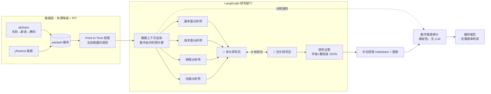

# 格物 Gewu

> 格物致知 —— A股优先的金融研究多智能体框架：分析师团队 + 多空辩论 + **数字溯源审计** + **防泄漏 Point-in-Time 评测**

[]() []() []()

`gewu analyze 600519` 一条命令，产出一份**每个数字都能回溯到数据源**的中文研究报告。

---

## 为什么做这个项目

2026 年的开源金融 agent 已经很多（TradingAgents ~85k stars、ai-hedge-fund ~60k、FinRobot 7k+），但经过[系统性调研](docs/research/)（107 个检索/核验子任务、25 个来源交叉验证），三个空白依然真实存在：

| 空白 | 现状（2026-06 实测） | 格物的做法 |
|---|---|---|
| **A股本土数据栈** | TradingAgents 仅靠 Yahoo 后缀覆盖 A股；ai-hedge-fund 锁死美股商业 API；FinRobot 数据层全是美股生态 | akshare 多源降级（东财→新浪→腾讯）+ 巨潮概况 + 东财估值/新闻，全免费、实测可用 |
| **真正完整开源** | 最大中文竞品 TradingAgents-CN（28k stars）前后端专有授权，v2.0 不开源 | 全仓 Apache-2.0，无保留 |
| **可信的评测** | FINSABER（KDD 2026）证明该领域的短窗口回测因幸存者偏差/数据窥探**系统性高估** LLM 策略 | 内置 Point-in-Time 防泄漏回测 + 朴素基线同 panel 对照 + 自带局限性声明 |

另外两个所有人都没做的事：

1. **数字溯源审计**：LLM 投研最常见的失败模式是幻觉数字。格物对每份研报做确定性审计——正文中每个实质性数字必须能在 agent 实际看到的数据上下文中找到出处，溯源率和不可溯源清单直接写进报告附录。
2. **法定披露日 PIT**：历史回测时财报按 A股法定披露截止日判定可见性（年报次年 4-30、三季报当年 10-31……），保守但**零未来信息泄漏**——agent 可能比真实世界晚看到财报，评测偏保守而非偏乐观。

## 架构



关键设计决策（详见 [docs/architecture.md](docs/architecture.md)）：

- **数字由代码算，LLM 只解读**——技术指标、估值分位、财务增速全部预计算后注入上下文，从源头压制幻觉；
- **审计语料 = agent 看到的语料**——溯源审计的对照文本就是渲染给 LLM 的数据上下文，所见即所审；
- **评测与生产同一条代码路径**——回测里跑的就是 `ResearchPipeline` 本身，不存在"评测专用逻辑"。

## 快速开始

```bash
git clone https://github.com/Young-1231/gewu && cd gewu
uv sync

# 演示模式（无需 API key；首次运行需联网抓取行情，缓存后可离线复跑）
uv run gewu analyze 600519 --mock

# 真实分析：任一 OpenAI 兼容端点，默认 DeepSeek
cp .env.example .env   # 填入 GEWU_API_KEY（或 DEEPSEEK_API_KEY / OPENAI_API_KEY）
uv run gewu analyze 600519                  # 贵州茅台
uv run gewu analyze AAPL                    # 美股兼容
uv run gewu analyze 600519 --as-of 2025-04-15   # 历史时点（PIT 视图：彼时年报尚未披露）
```

输出示例（`reports/600519_<date>.md`）：评级与置信度、投资要点、四分析师观点、多空辩论纪要、风险提示、价格/估值图表、数据源与 PIT 说明、**数字溯源审计附录**。

### 切换模型

```bash
# .env 中任意 OpenAI 兼容端点
GEWU_BASE_URL=https://api.deepseek.com   GEWU_MODEL=deepseek-chat      # 默认
GEWU_BASE_URL=https://dashscope.aliyuncs.com/compatible-mode/v1  GEWU_MODEL=qwen-plus
GEWU_BASE_URL=https://api.openai.com/v1  GEWU_MODEL=gpt-4.1
```

## 评测：证明它有用（或诚实地证明它没用）

```bash
# Point-in-Time 走查回测：评级 → 60 个交易日前向收益，对照动量/买入持有基线
uv run gewu backtest --symbols 600519,000858,601318 --start 2024-06-30 --end 2025-12-31

# 防幸存者偏差：按 start 日期的沪深300「历史成分」抽样（baostock，含已退市股票）
uv run gewu backtest --universe csi300 --sample 20 --start 2023-12-31 --seed 42
```

输出：方向命中率、CR/年化/夏普/最大回撤对照表、评级分布、平均溯源率，以及**强制附带的局限性声明**（评测窗口、牛熊状态偏差、成本未建模等——参照 FINSABER 方法论自查清单）。

> 本项目不宣称"显著盈利能力"。FINSABER（KDD 2026）已证明此前文献中 LLM 择时优势在长周期、宽截面、含退市股的回测下显著衰减。格物的评测模块存在的意义恰恰是：**让任何这样的宣称必须先过防泄漏回测这一关。**

## 测试

```bash
uv run pytest      # 全离线、确定性（夹具为 2026-06-11 抓取的真实数据快照）
uv run ruff check src tests
```

覆盖：PIT 边界（法定披露日当天/前一天）、缓存退化语义、溯源审计契约（舍入/单位换算/负数/年份豁免）、多空辩论轮数、端到端管线、回测指标。

## 项目结构

```
src/gewu/
├── config.py        # OpenAI 兼容配置，默认 DeepSeek
├── llm.py           # ChatLLM（重试/JSON模式）+ MockLLM（离线演示）
├── data/            # 多源降级 + parquet 缓存 + PIT 规则 + 技术指标
├── agents/          # LangGraph 图：4 分析师 ∥ → 多空辩论 ⇄ → 研究主管 → 溯源审计
├── report/          # 中文研报装配 + matplotlib 图表
├── evaluate/        # PIT 走查回测 + 基线 + 指标 + 历史成分股票池
└── cli.py           # gewu analyze / backtest / fetch
```

## 已知局限

- 新闻接口只保留近期条目 → 历史回测时点的舆情覆盖有限（报告中会如实标注）；
- 财报可见性按法定截止日保守判定，真实公告日集成（巨潮）在路线图上；
- 美股为兼容档：估值历史分位等深度数据弱于 A股（SEC EDGAR 集成在路线图上）；
- 评级为离散仓位，回测未建模交易成本。

## 路线图

- [ ] 巨潮公告原文 RAG（财报问答、公告事件抽取）
- [ ] 真实公告日数据替代法定截止日近似
- [ ] FinEval Financial Agent 子集（616 题）跑分
- [ ] 行业横向对比 agent（同行估值/景气度）
- [ ] SEC EDGAR 集成，美股升级为一等公民

## 调研与参考

本项目的每个设计决策都有据可查：[docs/research/](docs/research/) 含完整的竞品调研（25 来源、3 票对抗核验）、数据源工程可行性报告、商业产品与招聘趋势分析。

核心参考文献：TradingAgents ([arXiv:2412.20138](https://arxiv.org/abs/2412.20138))、FinRobot ([arXiv:2405.14767](https://arxiv.org/abs/2405.14767))、FINSABER ([arXiv:2505.07078](https://arxiv.org/abs/2505.07078), KDD 2026)、FinEval ([arXiv:2308.09975](https://arxiv.org/abs/2308.09975), NAACL 2025)。

## 免责声明

本项目仅用于技术研究与演示，AI 生成的分析不构成任何投资建议。数字溯源审计验证数字出处，不验证观点正确性。市场有风险，投资需谨慎。

## License

[Apache-2.0](LICENSE)（全仓库，无保留目录）
