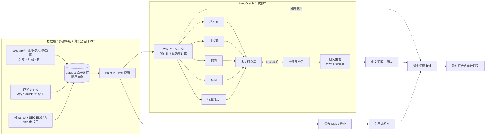

# 格物 Gewu

**A股优先的金融研究多智能体框架** — 分析师团队协作、公告级溯源、防泄漏评测。
*An A-share-first multi-agent framework for equity research, with number-level provenance auditing and leak-free point-in-time evaluation.*

[](https://github.com/Young-1231/gewu/actions/workflows/ci.yml)
[](LICENSE)
[](pyproject.toml)

```bash
gewu analyze 600519 --peers 000858,000568   # 多智能体研报：四分析师 + 行业对比 + 多空辩论 + 评级
gewu ask 600519 "2025年度每股分红多少？"      # 公告 RAG 问答：页码级引用
gewu backtest --universe csi300 --sample 20 --start 2023-12-31   # 防泄漏 PIT 回测
gewu benchmark --data fineval.csv            # 金融知识基准跑分
```

---

## 它做什么

**`gewu analyze`** 对一只 A股/美股生成结构化中文研报：基本面、技术面、舆情、估值四位分析师并行分析（可选行业对比分析师），多空研究员结构化辩论，研究主管给出评级与置信度。每份研报自带**数字溯源审计附录**——正文中每个实质性数字都被核对是否能在 agent 实际看到的数据中找到出处，连模型自己算对的衍生数字也会被标记请人工核验。

**`gewu ask`** 基于巨潮资讯的定期报告全文回答问题，答案带页码级引用（如 *《2025年年度报告》第2页*），数字同样过溯源审计。

**`gewu backtest`** 用与生产完全相同的管线做时点走查回测：每个评测时点 agent 只能看到**彼时已公告**的数据，与动量、买入持有基线同 panel 对照，汇总强制附带局限性声明。

**`gewu benchmark`** 对底座模型跑金融多选题基准（FinEval 兼容格式）。

## 核心设计

| 设计 | 实现 | 为什么 |
|---|---|---|
| **A股本土数据栈** | akshare 多源自动降级（东财→新浪→腾讯）+ 巨潮公告 + 东财估值/新闻，全部免费源 | 头部开源框架（TradingAgents、ai-hedge-fund、FinRobot）均无 A股本土数据源的可用代码路径（[调研](docs/research/)） |
| **数字溯源审计** | 确定性审计（无 LLM）：报告数字 ←→ agent 输入语料逐一比对，含舍入/单位换算/负号归一 | LLM 投研最高频的失败模式是幻觉数字；事后口头保证不如每份报告自带审计结果 |
| **真实公告日 PIT** | 财报可见性按巨潮**真实公告时间**（美股按 SEC EDGAR `filed` 申报日）判定，缺失时退回法定披露截止日——任何数据缺口都只会更保守，绝不泄漏未来 | 评测可信的前提；时区与日界处理有专门回归测试 |
| **诚实评测** | 走查回测复用生产管线、支持按**历史指数成分**抽样（含退市股）、固定种子可复现、强制基线对照与局限声明 | FINSABER（KDD 2026）证明该领域普遍的短窗口回测因幸存者偏差系统性高估 LLM 策略——本项目不重复这个错误 |
| **完全开源** | 全仓 Apache-2.0，无专有目录 | 最大同类中文项目采用混合授权（前后端闭源） |

## 架构



\* 行业对比分析师在提供 `--peers` 时启用。设计细节见 [docs/architecture.md](docs/architecture.md)。

## 安装与使用

需要 Python 3.12+ 与 [uv](https://docs.astral.sh/uv/)：

```bash
git clone https://github.com/Young-1231/gewu && cd gewu
uv sync
cp .env.example .env   # 填入任一 OpenAI 兼容端点的 API key（默认 DeepSeek）
```

```bash
# 研报（实时）
uv run gewu analyze 600519
# 研报 + 行业对比分析师
uv run gewu analyze 600519 --peers 000858,000568
# 历史时点研报（PIT：只用彼时已公告的数据）
uv run gewu analyze 600519 --as-of 2025-04-15
# 公告问答（首次自动下载 PDF 并建库）
uv run gewu ask 600519 "主营业务收入的构成是怎样的？"
# 回测：按 2023 年末沪深300 历史成分抽 20 只，季度评测
uv run gewu backtest --universe csi300 --sample 20 --start 2023-12-31
# 基准跑分（自带格式样例；FinEval 等数据请从官方渠道获取）
uv run gewu benchmark --data data/benchmark_sample.jsonl
# 无 API key 时验证全链路（不调用真实 LLM；数据抓取仍需联网）
uv run gewu analyze 600519 --mock
```

### 配置

任一 OpenAI 兼容端点均可（DeepSeek / Qwen / Moonshot / OpenAI / vLLM 自部署）：

| 环境变量 | 默认 | 说明 |
|---|---|---|
| `GEWU_API_KEY` | — | 也接受 `DEEPSEEK_API_KEY` / `OPENAI_API_KEY` |
| `GEWU_BASE_URL` | `https://api.deepseek.com` | OpenAI 兼容端点 |
| `GEWU_MODEL` | `deepseek-chat` | 模型名 |
| `GEWU_DEBATE_ROUNDS` | `2` | 多空辩论轮数 |
| `GEWU_CACHE_DIR` | `~/.gewu/cache` | 数据缓存目录 |
| `GEWU_REQUEST_INTERVAL` | `1.0` | 上游请求最小间隔（秒），保护免费接口 |

## 数据源

| 数据 | 主源 | 降级 | 备注 |
|---|---|---|---|
| A股日线 | 东方财富 | 新浪 → 腾讯 | 前复权；任一可用即工作 |
| A股财务 | 新浪财务指标 + 同花顺摘要 | — | 报告期粒度 |
| A股估值 | 东财数据中心（PE/PB/市值日频） | 百度股市通 | 五年分位由代码计算 |
| 公告/公告日 | 巨潮资讯官方 API | 法定披露截止日兜底 | PDF 全文本地缓存 |
| 美股财务 | **SEC EDGAR**（真实 `filed` 日期） | yfinance + 保守滞后 | data.sec.gov 对部分地区 IP 返回 403，自动降级 |
| 美股行情/新闻 | yfinance | — | 注意 Yahoo 限流 |
| 历史指数成分 | baostock | — | 含退市股，防幸存者偏差回测的基础 |

所有上游请求经原子写入的本地 parquet 缓存（损坏自动清除重抓）与全局限速。

## 评测立场

本项目**不宣称盈利能力**。FINSABER（[KDD 2026](https://arxiv.org/abs/2505.07078)）已证明：此前文献报告的 LLM 择时优势，在长周期、宽截面、含退市股的回测下显著衰减，且 LLM 策略存在"牛市过度保守、熊市过度激进"的系统性偏差。`gewu backtest` 的存在意义是让任何效果宣称必须先通过防泄漏回测，输出的每份汇总都强制附带局限性自查清单。

## 项目结构

```
src/gewu/
├── config.py / llm.py     # OpenAI 兼容配置与客户端（含离线 Mock）
├── data/                  # 多源降级、原子缓存、PIT 规则、技术指标、巨潮/EDGAR 适配
├── agents/                # LangGraph 图、五类分析师、多空辩论、研究主管、溯源审计
├── rag/                   # 公告库、BM25 检索、引用式问答
├── report/                # 研报装配与图表
├── evaluate/              # PIT 回测、基线、指标、历史成分股票池、基准跑分
└── cli.py                 # analyze / ask / backtest / benchmark / fetch
tests/                     # 60+ 项全离线确定性测试（真实数据快照夹具）
docs/                      # 架构文档、调研报告、示例研报
```

## 已知局限

- 免费新闻接口只保留近期条目，历史回测时点的舆情覆盖有限（报告中如实标注）；
- 公司概况无法回溯历史时点（已做最小化处理并标注残余前视风险）；
- 前复权价格以抓取日为锚，评测只使用收益率，不受影响；
- 回测为离散仓位，未建模交易成本与流动性；
- BM25 为词面检索，语义改写问题的召回弱于 embedding 方案（检索器可插拔）。

## 路线图

- [ ] Embedding 检索与重排（可插拔接入 BGE 等中文向量模型）
- [ ] 美股财报全文问答（SEC EDGAR 文档库）
- [ ] 公告事件流监控（减持/质押/业绩预告的结构化抽取）
- [ ] Web UI

## 调研与参考

设计决策的完整依据见 [docs/research/](docs/research/)：竞品全景（多来源对抗核验）、数据源工程可行性、商业产品对比。

核心参考：TradingAgents ([arXiv:2412.20138](https://arxiv.org/abs/2412.20138)) · FinRobot ([arXiv:2405.14767](https://arxiv.org/abs/2405.14767)) · FINSABER ([arXiv:2505.07078](https://arxiv.org/abs/2505.07078)) · FinEval ([arXiv:2308.09975](https://arxiv.org/abs/2308.09975))

## 贡献与许可

欢迎 Issue 与 PR，约定见 [CONTRIBUTING.md](CONTRIBUTING.md)。代码以 [Apache-2.0](LICENSE) 发布，全仓库无保留目录。

**免责声明**：本项目仅用于技术研究，AI 生成的分析不构成投资建议。数字溯源审计验证数字出处，不验证观点正确性。市场有风险，投资需谨慎。
