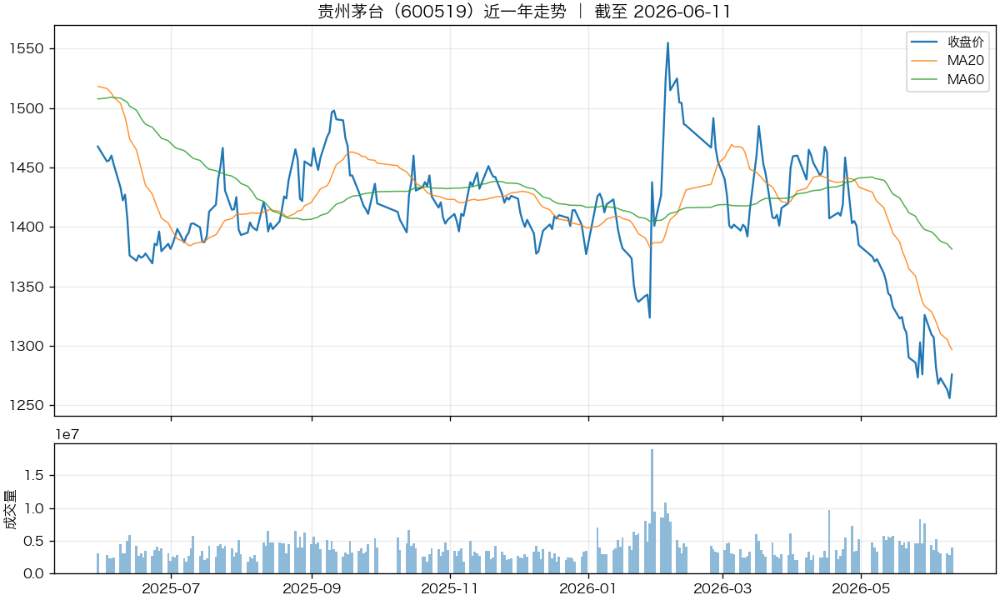
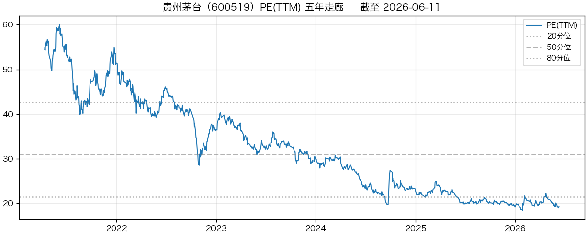

# 贵州茅台（600519）研究报告

> 评级：**🟧 增持** ｜ 置信度：65% ｜ 分析基准日：2026-06-11 ｜ 引擎：格物 Gewu 多智能体

<!--audit:start-->
## 投资要点

贵州茅台当前PE(TTM)19.28处于近五年1.3%分位，PB 5.89处于0.5%分位，估值安全边际显著。2026年一季度营收增6.54%、净利增1.37%，虽增速放缓，但优于五粮液和泸州老窖的负增长，龙头韧性凸显。分红上调至28.02423元/股，6月10日主力资金净流入4.02亿元，资金面回暖。但净利润增速仅1.37%，毛利率数据缺失，技术面空头排列，短期仍有压力。综合权衡，估值低位提供支撑，但盈利弹性不足，给予增持评级。

- 估值处于历史极低分位，PE分位1.3%、PB分位0.5%，安全边际高
- 营收和净利增速优于主要竞争对手，相对基本面优势明显
- 分红上调至28.02423元/股，股东回报提升
- 6月10日主力资金净流入4.02亿元，逆行业获机构青睐

## 分析师观点

### 基本面分析师

### 基本面分析报告：贵州茅台（600519）

**盈利能力与成长性评估**  
2026年一季度（截至2026-03-31），公司营收同比增长6.54%，归母净利润同比仅增长1.37%，利润增速显著低于营收增速，显示盈利能力承压。当期ROE为10.06%，较2025年一季度的10.39%略有下滑，但高于2024年同期水平（数据不可用）。销售毛利率数据不可用，无法直接判断成本端压力。每股收益（EPS）为22.48元，较2025年一季度的22.11元小幅提升，但增速放缓。

**趋势变化分析**  
**成长性明显恶化**：营收增速从2024年中的17.76%持续下滑至2025年底的-1.21%（负增长），2026年一季度虽回升至6.54%，但净利润增速仅1.37%，远低于2024年同期的11.62%，反映终端需求疲软或费用刚性。**财务质量稳健**：资产负债率从2025年底的16.42%降至12.12%，处于历史低位，偿债风险极低。ROE从2025年底的33.65%回落至10.06%，主要受季节性因素影响（一季度通常为淡季），但全年趋势需观察后续季度。

**基本面结论**  
贵州茅台短期面临营收与利润增速背离的压力，净利润增速仅1.37%，显示盈利弹性减弱；但极低的资产负债率（12.12%）和稳定的EPS（22.48元）支撑其财务安全垫。需关注后续季度毛利率数据及费用控制效果，以判断利润增速能否修复。

### 技术面分析师

### 技术面分析结论

截至2026年6月10日，贵州茅台收盘价1275.88元，处于空头排列格局（价<MA20<MA60），短期均线压制明显。MACD指标中，DIF（-28.49）与DEA（-29.08）虽仍为负值，但DIF已上穿DEA形成金叉，显示下跌动能有所衰减，短期存在技术性修复需求。RSI14为39.49，处于弱势区域但未超卖，表明市场情绪偏弱但未极端。量比1.12显示成交温和放大，但近20日波动率22.77%偏高，价格波动风险仍存。

**结论**：贵州茅台短期处于空头趋势，但MACD金叉信号提示下跌动能减弱，可能进入低位震荡或弱势反弹阶段。关键阻力位参考MA20（1296.87），若无法有效突破，则需警惕二次探底风险。

### 新闻舆情分析师

### 舆情分析报告

**股票名称：** 贵州茅台（600519.SH）  
**分析基准日：** 2026-06-11  

#### 一、关键事件识别与评估
1. **利润分配方案调整（2026-06-02）**  
   - 事实：公司因回购股份注销实施完成，将2025年年度每股分红从27.993元（含税）调整为28.02423元（含税）。  
   - 舆情倾向：**偏多**。分红金额提升直接增厚股东回报，体现公司治理积极。  

2. **股价跌破1300元/股（2026-06-03）**  
   - 事实：当日股价跌至1281元/股附近，跌幅约2%。  
   - 舆情倾向：**偏空**。短期市场情绪悲观，但未提供具体触发因素，需结合行业资金流出判断。  

3. **行业资金流出与个股资金流入分化（2026-06-09至06-10）**  
   - 事实：6月9日白酒概念下跌1.10%，贵州茅台主力资金净流出数据不可用；6月10日食品饮料行业资金流入榜显示，贵州茅台主力资金净流入40159.13万元，涨幅1.58%。  
   - 舆情倾向：**中性偏多**。行业整体承压，但茅台逆势获资金青睐，显示龙头韧性。  

4. **股东会相关事件（2026-06-10）**  
   - 事实：股东会前晚宴不供酒，有股东自带其他品牌白酒；但斌微博再提“拆股”建议。  
   - 舆情倾向：**中性**。晚宴“去酒化”属管理细节，拆股建议为市场讨论，均无实质政策落地。  

#### 二、舆情结论
**综合评估：偏多**  
- 核心支撑：分红方案上调（每股28.02423元）直接提升股东价值，且6月10日主力资金净流入40159.13万元，显示机构信心。  
- 风险点：股价短期跌破1300元/股及行业资金流出（白酒概念下跌1.10%）反映市场情绪偏弱，但未改变公司基本面。  
- 结论：近期事件以公司治理改善（分红提升）和资金面回暖为主，对股价形成正面支撑，建议关注股东会后续政策信号。

### 估值分析师

作为一名估值分析师，基于2026年6月10日的数据，对贵州茅台（600519）的估值分析如下：

**估值水平与历史分位**
当前PE(TTM)为19.28，处于近五年历史分位的1.3%，属于极低水平；PB为5.89，处于近五年历史分位的0.5%，同样处于历史底部区域。总市值为15949.5亿元。从历史分位看，当前估值明显便宜。

**估值与成长匹配度**
近五年PE从2022年的36.40持续下降至2026年的19.28，PB从10.50降至5.89，估值中枢下移。结合盈利增速（数据不可用），无法直接判断当前估值与成长是否匹配。但考虑到PE和PB均处于历史极低分位，市场可能已充分消化了盈利增速放缓的预期。

**估值结论**
当前贵州茅台PE(TTM)19.28、PB 5.89均处于近五年历史最低区域（分位分别为1.3%和0.5%），估值具有显著安全边际。若未来盈利增速能企稳或回升，当前价格具备较强吸引力。

### 行业对比分析师

根据同行对比表数据，贵州茅台PE(TTM)为19.28倍，低于五粮液的24.38倍，但高于泸州老窖的12.64倍；其市净率5.89倍显著高于五粮液的2.40倍和泸州老窖的2.44倍。从基本面看，茅台营收同比增速6.54%、净利同比增速1.37%，均优于五粮液（-38.18%、-45.84%）和泸州老窖（-14.19%、-19.12%），且ROE达10.06%，远超五粮液的6.30%和泸州老窖的7.19%。茅台相对五粮液存在PE折价（19.28 vs 24.38），但相对泸州老窖存在PE溢价（19.28 vs 12.64），其高市净率主要由更强的盈利质量（ROE）和正增长支撑。**最有参考意义的可比公司是五粮液**，因其同为高端白酒龙头且市值规模接近。**相对估值结论**：茅台相对五粮液的PE折价与基本面优势（更高增速、更强盈利）不匹配，存在低估可能；相对泸州老窖的PE溢价则被其显著更优的成长性和ROE合理支撑。

## 多空辩论纪要

**🐂 多头（第1轮）**：基于四位分析师报告，我提炼以下做多理由：

1. **估值处于历史极低分位，安全边际显著**：当前PE(TTM)为19.28，处于近五年历史分位的1.3%；PB为5.89，处于近五年历史分位的0.5%。估值已充分反映盈利放缓预期，具备较强吸引力。

2. **基本面相对优势突出，龙头韧性显现**：2026年一季度营收同比增长6.54%、净利同比增长1.37%，增速均优于五粮液（-38.18%、-45.84%）和泸州老窖（-14.19%、-19.12%）；ROE达10.06%，远超五粮液6.30%和泸州老窖7.19%。相对五粮液的PE折价（19.28 vs 24.38）与基本面优势不匹配。

3. **资金面与治理改善形成支撑**：6月10日主力资金净流入40159.13万元，逆行业资金流出获机构青睐；分红方案上调至每股28.02423元，直接增厚股东回报。

（本轮无空头论点需反驳）

**🐻 空头（第1轮）**：### 空头研究员反驳

**核心风险：盈利增速断崖式放缓，基本面恶化信号明确**

1. **利润增速严重落后营收，盈利弹性消失**  
   2026年一季度营收同比增长6.54%，但归母净利润仅增长1.37%，增速差距达5.17个百分点。对比2024年同期净利润增速11.62%，当前增速骤降88%，反映终端需求疲软或费用刚性侵蚀利润。**数据不可用**的毛利率无法排除成本端压力。

2. **成长性趋势持续恶化**  
   营收增速从2024年中17.76%断崖式下滑至2025年底的-1.21%（负增长），2026年一季度虽回升至6.54%，但净利润增速仅1.37%，远低于2024年同期的11.62%。**成长性明显恶化**是基本面分析师的明确结论。

3. **技术面空头格局未改**  
   收盘价1275.88元仍低于MA20（1296.87元）和MA60，均线空头排列。MACD金叉仅预示下跌动能衰减，而非趋势反转——RSI14仅39.49仍处弱势区域，近20日波动率22.77%偏高，二次探底风险未解除。

**结论**：估值极低（PE分位1.3%）是盈利恶化预期的结果，而非低估信号。净利润增速1.37%无法支撑当前估值修复，建议回避。

**🐂 多头（第2轮）**：### 多头研究员第2轮反驳

**核心做多理由不变，直接反驳空头论点：**

1. **盈利增速放缓≠基本面崩溃，相对优势才是关键**  
   空头强调净利润增速仅1.37%，但**行业对比分析师**明确指出：茅台营收增速6.54%、净利增速1.37%，均**优于**五粮液（-38.18%、-45.84%）和泸州老窖（-14.19%、-19.12%）。在行业整体负增长背景下，茅台仍保持正增长，龙头韧性已通过数据验证。空头所谓“盈利弹性消失”是行业共性，而非茅台特有问题。

2. **估值极低已充分定价悲观预期**  
   空头称“估值是盈利恶化预期的结果”，但**估值分析师**数据显示：PE(TTM)19.28处于近五年历史分位**1.3%**，PB 5.89处于**0.5%**——这已是极端底部。若盈利进一步恶化，下行空间有限；若企稳，估值修复弹性极大。空头无法解释：为何相对五粮液（PE 24.38、净利-45.84%），茅台（PE 19.28、净利+1.37%）反而存在**PE折价**？这恰恰是低估信号。

3. **资金面与治理改善对冲技术面弱势**  
   空头引用技术面空头排列，但**新闻舆情分析师**指出：6月10日主力资金净流入**40159.13万元**，逆行业资金流出（白酒概念下跌1.10%）获机构青睐。分红上调至每股**28.02423元**直接增厚股东回报。技术面MACD金叉（DIF -28.49上穿DEA -29.08）已显示下跌动能衰减，资金面回暖可能催化短期修复。

**结论**：空头聚焦于行业共性的增速放缓，却忽略茅台相对五粮液、泸州老窖的**基本面优势**和**极端估值折价**。净利润增速1.37%虽低，但对比同行负增长已是稀缺正增长，叠加PE历史分位1.3%的安全边际，当前价格具备中长期配置价值。

**🐻 空头（第2轮）**：### 空头研究员第2轮反驳

**空头立场不变：盈利恶化趋势未改，估值底部非买入信号**

1. **净利润增速1.37%是茅台自身趋势恶化，非行业共性**  
   多头称“行业共性”，但**基本面分析师**明确结论是“成长性明显恶化”——营收增速从2024年中17.76%持续下滑至2025年底的-1.21%，2026年一季度虽回升至6.54%，但净利润增速仅1.37%，远低于2024年同期的11.62%。**数据不可用**的毛利率无法排除成本端压力。同行负增长不能掩盖茅台自身增速骤降88%的事实。

2. **PE折价反映市场对茅台盈利可持续性的质疑**  
   多头用五粮液PE 24.38对比茅台PE 19.28论证低估，但**行业对比分析师**同时指出：泸州老窖PE仅12.64，且茅台市净率5.89显著高于五粮液2.40和泸州老窖2.44。高PB需高ROE支撑，但ROE已从2025年底的33.65%回落至10.06%（季节性因素），若后续季度无法修复，PB溢价将面临收缩风险。

3. **技术面空头格局与资金面回暖矛盾**  
   6月10日主力资金净流入40159.13万元，但收盘价1275.88元仍低于MA20（1296.87元），RSI14仅39.49处于弱势区域。MACD金叉仅预示下跌动能衰减，而非趋势反转——近20日波动率22.77%偏高，二次探底风险未解除。

**结论**：PE分位1.3%是盈利增速持续恶化的结果，而非低估信号。净利润增速1.37%无法支撑当前估值修复，建议回避。

## 风险提示

- 净利润增速仅1.37%，盈利弹性不足，毛利率数据缺失
- 技术面空头排列，RSI 39.49弱势，波动率22.77%偏高
- 行业整体承压，白酒概念下跌1.10%，市场情绪偏弱

<!--audit:end-->

## 图表

## 数据与方法

- 数据源：daily=sina、report_dates=cninfo、financial_indicators=sina、financial_abstract=ths、valuation=eastmoney、news=eastmoney_news、profile=cninfo
- Point-in-Time：所有数据截断至 2026-06-11；财报按法定披露截止日判定可见性（保守、零泄漏）

## 免责声明

本报告由开源项目「格物 Gewu」的多智能体系统自动生成，仅用于技术演示与研究，不构成任何投资建议。AI 生成内容可能存在错误；数字溯源审计仅验证数字出处，不验证观点正确性。市场有风险，投资需谨慎。

## 数字溯源审计

- 实质性数字总数：**166**
- 可溯源至数据上下文：**161**（溯源率 **97.0%**）
- ⚠️ 以下数字无法在数据上下文中找到出处，使用前请人工核验：

  - `4.02亿元` —— …23元/股，6月10日主力资金净流入4.02亿元，资金面回暖。但净利润增速仅1.3…
  - `4.02亿元` —— …报提升 - 6月10日主力资金净流入4.02亿元，逆行业获机构青睐 ## 分析师…
  - `5.17` —— …母净利润仅增长1.37%，增速差距达5.17个百分点。对比2024年同期净利润增…
  - `88%` —— …净利润增速11.62%，当前增速骤降88%，反映终端需求疲软或费用刚性侵蚀利…
  - `88%` —— …。同行负增长不能掩盖茅台自身增速骤降88%的事实。 2. **PE折价反映…
